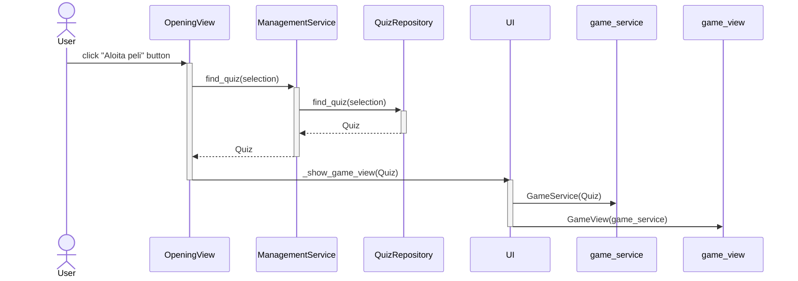

# Arkkitehtuurikuvaus

## Ohjelman rakenne

Tässä on esitelty sovelluksen tuleva pakkausrakenne ja keskeisimmät luokat:

## Keskeisiä toiminnallisuuksia

### Sekvenssikaavio Aloita peli -napin painamisesta

Tämä sekvenssikaavio kuvaa sitä, kun käyttäjä painaa Aloita peli -painiketta. Ensin ohjelma selvittää, minkä visailun käyttäjä on valinnut listalta. Sitten se hakee tietokannasta visailun tiedot, jotka tietokanta palauttaa Quiz-oliona. Tämän jälkeen ohjelma luo GameService-palvelun, joka tarvitsee Quiz-olion parametrikseen. Lopulta voidaan siirtyä GameView-näkymään ja peli alkaa.

