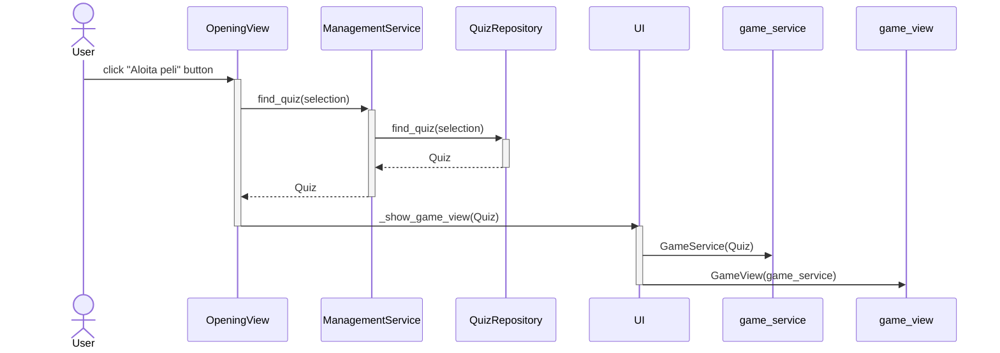

# Arkkitehtuurikuvaus

## Ohjelman rakenne

Tässä on esitelty sovelluksen tuleva pakkausrakenne ja keskeisimmät luokat:

Pakkausten roolit ovat seuraavanlaiset:
- Pakkaus ui sisältää ohjelman eri näkymistä vastaavat luokat
- Pakkaus services sisältää sovelluslogiikasta vastaavan koodin. Koska pelinäkymän tarvitsemat toiminnallisuudet ovat niin erilaisia verrattuna muuhun sovelluslogiikkaan, on palvelut jaettu kahteen eri luokkaan:
  - GameService, joka vastaa pelin toiminnallisuudesta
  - ManagementService, joka vastaa sovelluksen muista toiminnallisuuksista kuten visailun luomiseen liittyvästä logiikasta

## Käyttöliittymä
Käyttöliittymässä on kolme erilaista näkymää:
- Aloitusnäkymä
- Pelinäkymä
- Visailunluomisnäkymä

Vain yksi näkymistä on kerrallaan näkyvissä, ja näkymiä hallitsee erillinen UI-luokka. Sovelluslogiikka on eriytetty erillisiin luokkiin GameService ja ManagementService. 

Pelinäkymään liittyy aina GameService-olio, ja pelinäkymä kutsuu GameServicen tarjoamia metodeja esimerkiksi sanojen paljastamisessa ja pisteiden lisäämisessä. Käyttöliittymä saa kaikki tarvittavat tiedot siis GameService-oliolta. Siltä voi esimerkiksi kysyä, oliko valittu sana punainen. Näin käyttöliittymä osaa päivittää näkymää oikealla tavalla ilman että sen pitää itse huolehtia sovelluslogiikasta.

## Tietojen pysyväistallennus
Sovellus käyttää tietojen tallennukseen SQLite-tietokantaa. Kun käyttäjä suorittaa sovellusta alustaessaan komennon "poetry run invoke build", tietokanta alustetaan eli tietokantataulut Quizzes ja Puzzles luodaan ja niihin lisätään oletusarvoiset visailut, jotka ovat mukana malliksi ja ohjelman testaamista varten. Tietokanta alustetaan sijaintiin ./data/database.sqlite. 

Tietojen pysyväistallennus tapahtuu pakkauksen repositories luokan QuizRepository tarjoamien metodien avulla. Käytännössä luokkaa ei käytetä ohjelmakoodissa suoraan vaan ManagementService-luokan kautta. Tämä lisää joustavuutta, sillä näin tietojen tallennuksen toteutusta voi tarvittaessa vaihtaa ilman suuria muutoksia muualle ohjelmakoodin.

## Keskeisiä toiminnallisuuksia

### Sekvenssikaavio Aloita peli -napin painamisesta

Tämä sekvenssikaavio kuvaa sitä, kun käyttäjä painaa Aloita peli -painiketta. Ensin ohjelma selvittää, minkä visailun käyttäjä on valinnut listalta. Sitten se hakee tietokannasta visailun tiedot, jotka tietokanta palauttaa Quiz-oliona. Tämän jälkeen ohjelma luo GameService-palvelun, joka tarvitsee Quiz-olion parametrikseen. Lopulta voidaan siirtyä GameView-näkymään ja peli alkaa.

Kaavio antaa hyvän käsityksen siitä, miten sovelluksen luokat toimivat yhteistoimintana. QuizRepository-luokka kykenee käsittelemään tietokantaa, ja sitä käyttää luokka ManagementService. Käyttöliittymä (esim. OpeningView ja UI) saa puolestaan palveluita luokilta ManagementService ja GameService.