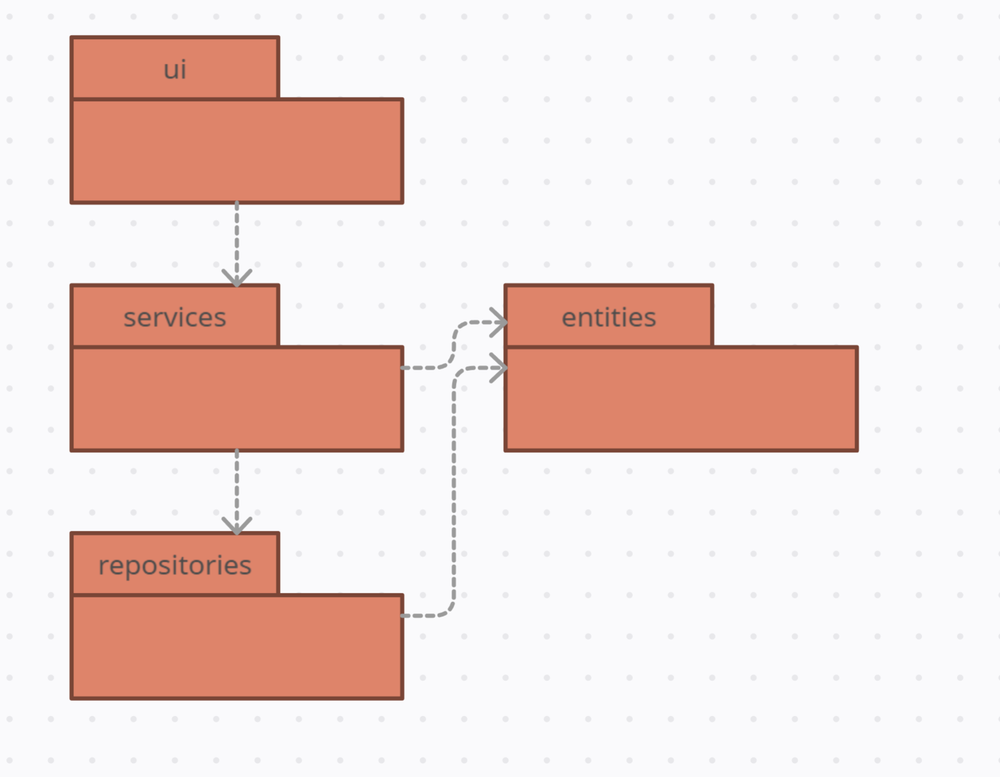
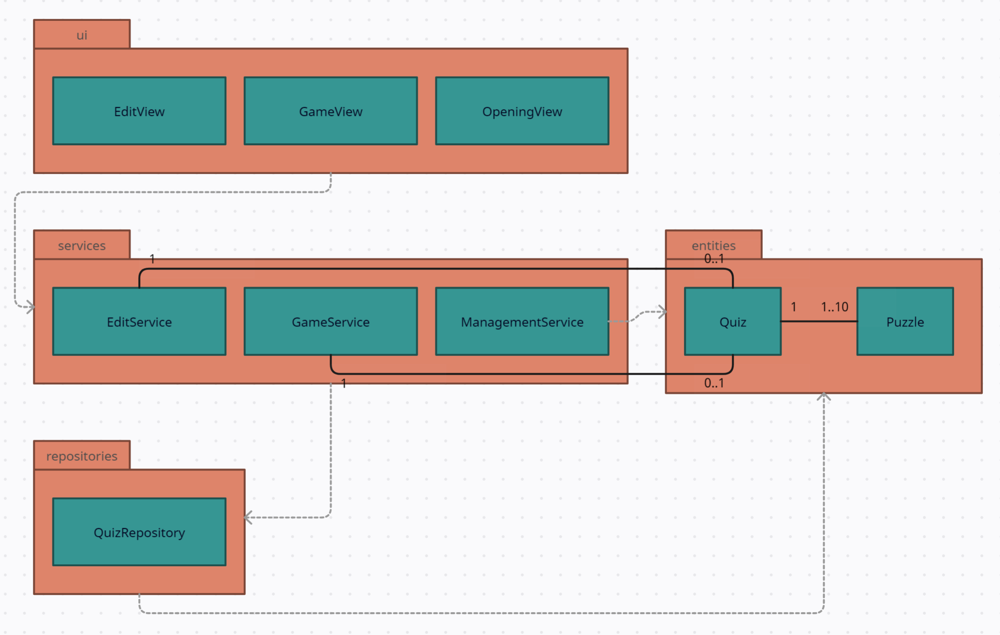
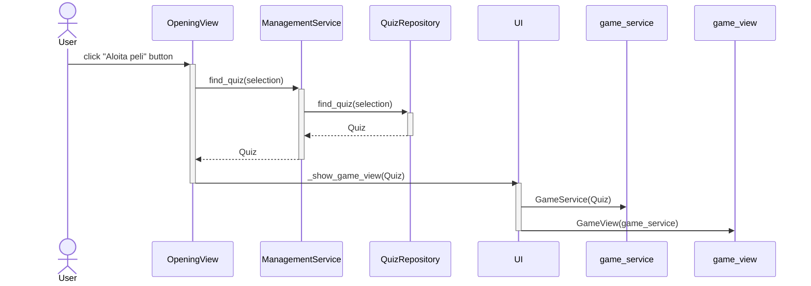

# Arkkitehtuurikuvaus

## Ohjelman rakenne

Ohjelman rakenne on kolmitasoisen kerrosarkkitehtuurin mukainen. Pakkausrakenne on seuraava:

Käyttöliittymästä vastaavat luokat löytyvät pakkauksesta _ui_, sovelluslogiikasta vastaavat luokat löytyvät pakkauksesta _services_, tiedon pysyväistallennuksesta vastaava luokka on sijoitettu pakkaukseen _repositories_ ja sovelluksen käsitteitä mallintavat luokat löytyvät pakkauksesta _entities_.

## Keskeisimmät luokat
Seuraava kaavio havainnollistaa keskeisimpien luokkien suhdetta toisiinsa:

- Käyttöliittymä koostuu kolmesta päänäkymästä: EditView, GameView ja OpeningView
- Koska eri näkymien tarvitsemat toiminnallisuudet ovat niin erilaisia keskenään, on palvelut jaettu kolmeen eri luokkaan:
  - GameService, joka vastaa pelin toiminnallisuudesta
    - GameService tarjoaa pelin logiikan sekä muistaa sen hetkisen pelitilanteen
  - ManagementService, joka vastaa yleisistä tietojenkäsittelyyn liittyvistä toimenpiteistä
  - EditService, joka vastaa uuden visailun luomiseen sekä olemassa olevan visailun muokkaamiseen tarvittavista palveluista
    - EditService muistaa sen hetkisen muokkauksen tilan, ja muokkaamisen voi tarvittaessa myös peruuttaa ennen tallentamista
- Sovelluksen käsitteet keskeiset käsitteet ovat visailu ja arvoitus, ja niitä kuvaavat luokat löytyvät pakkauksesta _entities_.

## Käyttöliittymä
Käyttöliittymässä on kolme erilaista päänäkymää:
- Aloitusnäkymä
- Pelinäkymä
- Visailunluomisnäkymä

Vain yksi näkymistä on kerrallaan näkyvissä, ja näkymiä hallitsee erillinen UI-luokka. Sovelluslogiikka on eriytetty erillisiin luokkiin GameService ja ManagementService. 

Pelinäkymään liittyy aina GameService-olio, ja pelinäkymä kutsuu GameServicen tarjoamia metodeja esimerkiksi sanojen paljastamisessa ja pisteiden lisäämisessä. Pelin käyttöliittymä saa kaikki tarvittavat tiedot siis GameService-oliolta. Siltä voi esimerkiksi kysyä, oliko valittu sana punainen. Näin käyttöliittymä osaa päivittää näkymää oikealla tavalla ilman että sen pitää itse huolehtia sovelluslogiikasta.

EditView-näkymään liittyy aina EditService-olio, joka hoitaa muokaaamiseen ja arvoitusten luomiseen tarvittavasta logiikasta. Uudet arvoitukset luodaan erillisessä ikkunassa, jota mallintaa luokka PuzzleCreationWindow.

## Tietojen pysyväistallennus
Sovellus käyttää tietojen tallennukseen SQLite-tietokantaa. Kun käyttäjä suorittaa sovellusta alustaessaan komennon "poetry run invoke build", tietokanta alustetaan eli tietokantataulut Quizzes ja Puzzles luodaan ja niihin lisätään oletusarvoiset visailut, jotka ovat mukana malliksi ja ohjelman testaamista varten. Tietokanta alustetaan sijaintiin ./data/database.sqlite. 

Tietojen pysyväistallennus tapahtuu pakkauksen repositories luokan QuizRepository tarjoamien metodien avulla. Käytännössä luokkaa ei käytetä ohjelmakoodissa suoraan vaan ManagementService- ja EditService -luokkien kautta. Tämä lisää joustavuutta, sillä näin tietojen tallennuksen toteutusta voi tarvittaessa vaihtaa ilman suuria muutoksia muualle ohjelmakoodin. Testauksessa tätä käytetään hyödyksi käyttämällä tietojen tallennukseen yksinkertaistettua FaceQuizRepository-nimistä luokkaa.

## Keskeisiä toiminnallisuuksia

### Aloita peli -napin painaminen

Tämä sekvenssikaavio kuvaa sitä, kun käyttäjä painaa Aloita peli -painiketta. Ensin ohjelma selvittää, minkä visailun käyttäjä on valinnut listalta. Sitten se hakee tietokannasta visailun tiedot, jotka tietokanta palauttaa Quiz-oliona. Tämän jälkeen ohjelma luo GameService-palvelun, joka tarvitsee Quiz-olion parametrikseen. Lopulta voidaan siirtyä GameView-näkymään ja peli alkaa.

Kaavio antaa hyvän käsityksen siitä, miten sovelluksen luokat toimivat yhteistoimintana. QuizRepository-luokka kykenee käsittelemään tietokantaa, ja sitä käyttää luokka ManagementService. Käyttöliittymä (esim. OpeningView ja UI) saa puolestaan palveluita luokilta ManagementService, EditService ja GameService. Tämä on se malli, jolla sovelluksen toiminnallisuudet toimivat yleisestikin.

## Ohjelman rakenteeseen jääneet heikkoudet

### Käyttöliittymä
Graafisen käyttöliittymän visuaalista ilmettä voisi parantaa paljonkin. Erityisesti pelinäkymän visuaalinen ilme on keskeneräinen. Se ei kuitenkaan ollut tämän kurssin fokuksena, joten se on siksikin jäänyt vähemmälle huomiolle.

Erityisesti pelinäkymän skaalautuvuutta tulisi kehittää. Sanaruutuihin piilotettavat sanat eivät kaikissa ympäristöissä skaalaudu vielä mielekkäällä tavalla.

### Koodi
- Esimerkkivisailut lisätään nyt tietokantaan _build.py_-tiedoston suorittamisen yhteydessä. Tällä hetkellä mallivisailut on kovakoodattu sisälle koodiin. Voisi olla tyylikkäämpää luoda ne omasta tiedostostaan.

