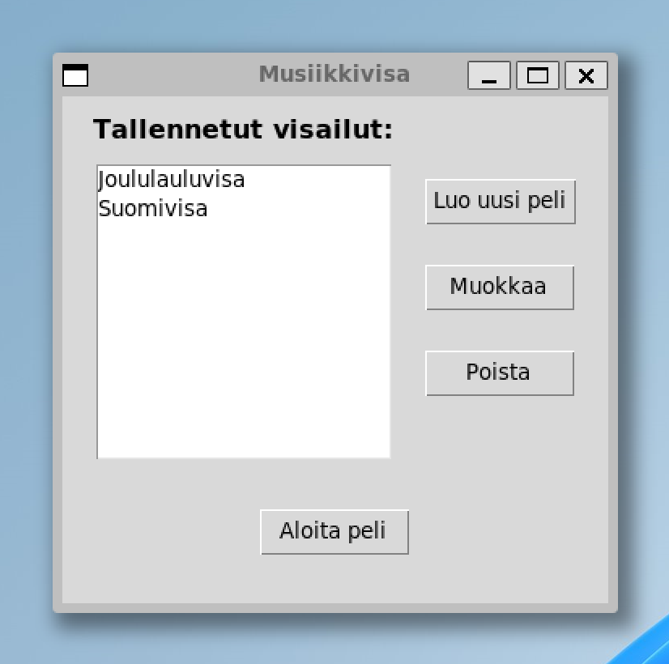
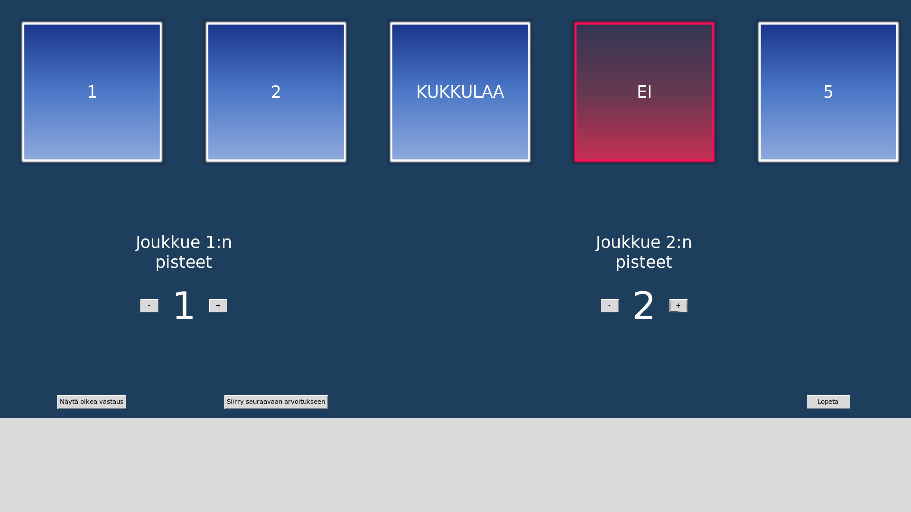
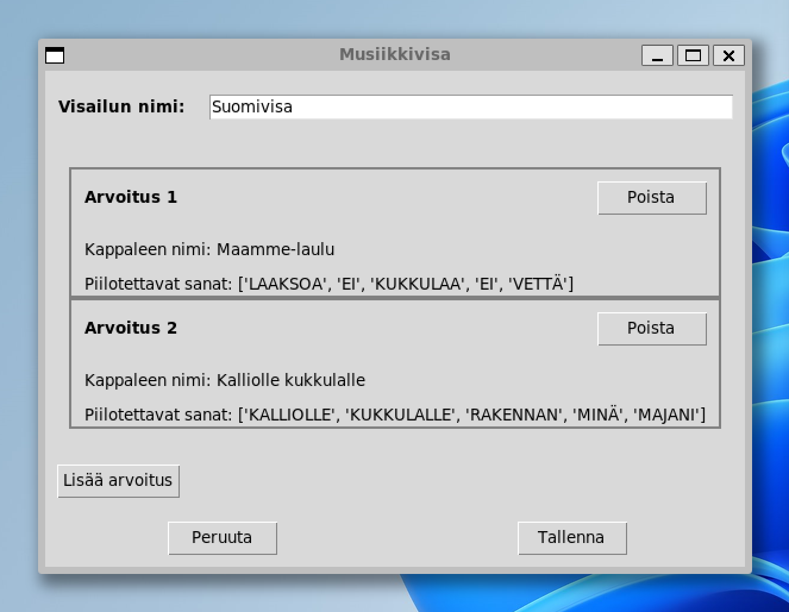

# Käyttöohje

Voit ladata projektin lähdekoodin klikkaamalla [tästä linkistä](https://github.com/vejol/ot-harjoitustyo/releases/tag/loppupalautus) ja valitsemalla Assets-kohdan alta Source code. Jos linkki ei jostain syystä toimi, viimeisin release löytyy menemällä ensin projektin etusivulle, valitsemalla sitten oikeanpuoleisesta palkista releases ja valitsemalla Assets-kohdan alta Source code.

## Konfigurointi

Sovellusta on mahdollista konfiguroida monella tapaa käynnistyshakemistossa sijaitsevan _.env_-tiedoston avulla. Mahdollisia konfiguraatioita ovat:

- Tiedon pysyväistallennukseen käytettävän tietokantatiedoston nimi
  - muuttuja DATABASE_FILENAME
  - tiedosto luodaan automaattisesti data-hakemistoon
  - oletusarvoinen nimi on database.sqlite
- Pelinäkymän sanaruutujen taustakuvat
  - muuttujat BLUE_IMG_FILENAME ja RED_IMG_FILENAME
  - kuvien tulee sijaita juurihakemiston _img_-kansiossa
  - oletuksena taustakuvat ovat nimeltään _blue.png_ ja _red.png_
- Arvoituksen nimen enimmäispituus (merkkiä)
  - muuttuja NAME_CHAR_LIMIT
  - Oletusarvoinen rajoitus on 100 merkkiä, koska se mahtuu hyvin useimmille näytöille
  - Jossakin tapauksissa käyttäjä voi haluta kuitenkin muuttaa tätä asetusta omaan järjestelmäänsä sopivammaksi
- Arvoitukseen piilotettavien sanojen enimmäispituus (merkkiä)
  - muuttuja WORD_CHAR_LIMIT
  - Oletuspituus on 12 merkkiä, koska se mahtuu vielä kauniisti ruutuun
- Peliin arvottavien punaisten sanojen määrä
  - muuttuja RED_WORDS_COUNT
  - Peliin arvotaan tämän muuttujan osoittama määrä punaisia sanoja
  - Oletusarvo on 2 (arvon tulee olla välillä 0-5)
  - Vinkki: Vaikka punaiset sanat ovat ajatuksena ikäviä, pelin sujuvuuden kannalta on hyvä, että punasia sanoja on jonkin verran, koska siten pelivuoro vaihtuu joukkueiden välillä useammin

## Ohjelman käynnistäminen

1. Tarvittavat riippuvuudet tulee asentaa ennen ohjelman suorittamista komennolla:

```bash
poetry install
```

2. Ennen ensimmäistä käyttökertaa tietokanta pitää alustaa. Toimenpide luo tarvittavat tietokantataulut ja lisää tietokantaan mallivisailut. Alustaminen suoritetaan komennolla:

```bash
poetry run invoke build
```

3. Sovellus käynnistetään komennolla:

```bash
poetry run invoke start
```

## Komentorivitoiminnot

### Ohjelman suorittaminen

Ohjelma suoritetaan komennolla:

```bash
poetry run invoke start
```

## Aloitus
Sovellus avautuu aloitusnäkymään:



Tässä näkymässä on listaus kaikista sovellukseen tallennetuista visailuista. Käyttäjä voi valita listalta haluamansa pelin ja aloittaa pelin painamalla Aloita peli -painiketta. Käyttäjä voi myös muokata tai poistaa haluamansa visailun. Vaihtoehtoisesti käyttäjä voi siirtyä visailunluomistilaan painamalla Luo uusi peli -painiketta.


## Pelaaminen

Kun käyttäjä aloittaa pelin, avautuu pelinäkymä kokonäytön tilassa. Seuraavassa kuvassa pelissä on jo avattu luukut 3 ja 4.



Pelinäkymässä käyttäjä voi klikata numeroituja laatikoita, jolloin laatikon takaa paljastuu jokin sana. Lisäksi kaksi satunnaista laatikkoa sisältää ns. punaisen sanan, jolla on pelissä erityismerkitys. Punaisten sanojen määrää voi muuttaa konfiguraatiotiedostossa.

Käyttäjä voi myös lisätä joukkueille pisteitä pelinäkymän pistelaskurien avulla.


## Visailunluomisnäkymä

Käyttäjä voi siirtyä aloitusnäytön painikkeella visailunluomisnäkymään:



Tässä näkymässä käyttäjä voi luoda oman visailunsa. Visailulle annetaan jokin nimi (esim. Joululauluvisa) ja visailuun liittyy yksi tai useampia arvoituksia. Kuhunkin arvoitukseen liittyy kappaleen nimi sekä 5 arvoitukseen piilotettavaa sanaa. Kun käyttäjä painaa lisää arvoitus -painiketta, avautuu uusi ikkuna, jossa käyttäjä voi syöttää arvoituksen tiedot: 


