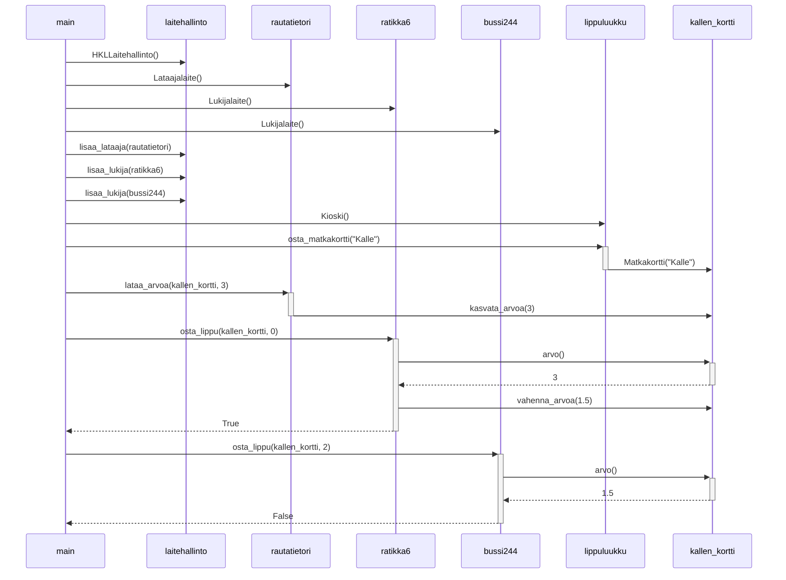

```mermaid
sequenceDiagram
main->>laitehallinto: HKLLaitehallinto()

main->>rautatietori: Lataajalaite()
main->>ratikka6: Lukijalaite()
main->>bussi244: Lukijalaite()

main->>laitehallinto: lisaa_lataaja(rautatietori)
main->>laitehallinto: lisaa_lukija(ratikka6)
main->>laitehallinto: lisaa_lukija(bussi244)

main->>lippuluukku: Kioski()
main->>+lippuluukku: osta_matkakortti("Kalle")
lippuluukku->>-kallen_kortti: Matkakortti("Kalle")

main->>+rautatietori: lataa_arvoa(kallen_kortti, 3)
rautatietori->>-kallen_kortti: kasvata_arvoa(3)

main->>+ratikka6: osta_lippu(kallen_kortti, 0)
ratikka6->>+kallen_kortti: arvo()
kallen_kortti-->>-ratikka6: 3
ratikka6->>kallen_kortti: vahenna_arvoa(1.5)
ratikka6-->>-main: True

main->>+bussi244: osta_lippu(kallen_kortti, 2)
bussi244->>+kallen_kortti: arvo()
kallen_kortti-->>-bussi244: 1.5
bussi244-->>-main: False
```